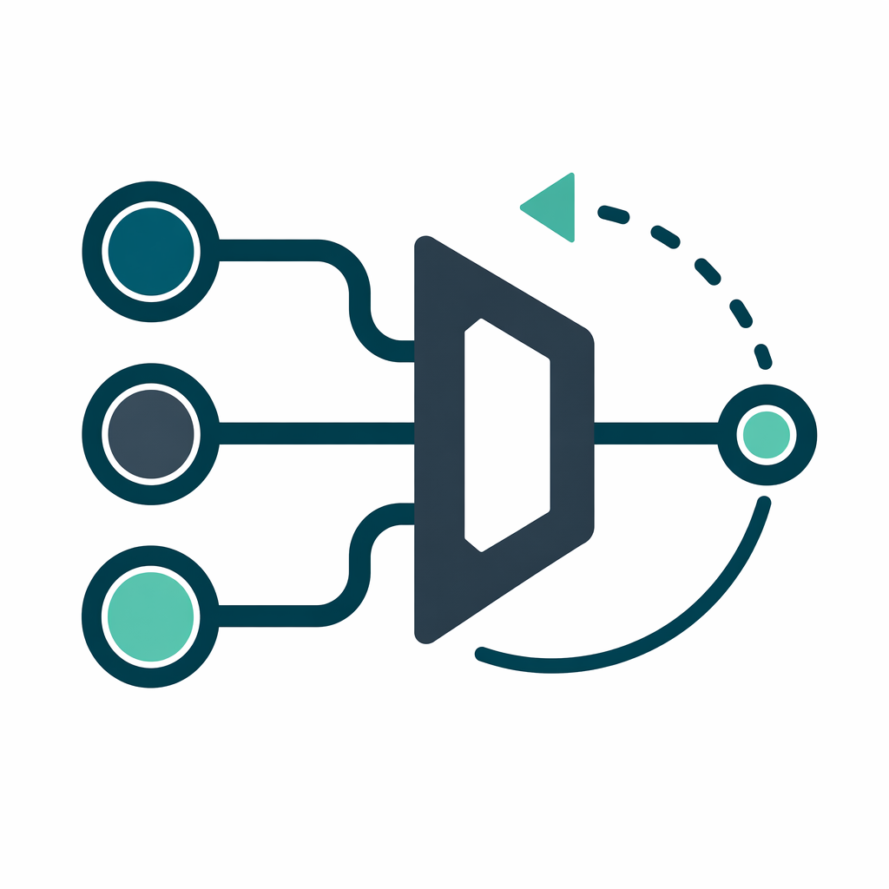

# mini-fallback-proxy



A small local proxy with:

- strict ordered fallback
- in-memory cooldown after failure
- automatic return to higher-priority providers after cooldown expires
- OpenAI-compatible `responses` and `chat.completions` endpoints
- Anthropic-compatible `messages` and `messages/count_tokens` endpoints for Claude Code style clients

It is designed to be a thin local layer, not a full gateway.

## Start

```bash
cd /path/to/mini-fallback-proxy
chmod +x ./start.sh
./start.sh --config ~/.config/litellm.yaml
```

`--config` is required.

`start.sh` will:

- install `uv` locally if it is missing
- create or update the project `.venv` with `uv sync`
- read bind settings from the config file
- launch the server with that config

## Config Example

Example file: [config.example.yaml](/Users/kky/Desktop/mini-proxy/config.example.yaml)

```yaml
app_settings:
  host: 0.0.0.0
  port: 8099
  log_level: info
  default_timeout: 60
  normalize_upstream_model: true

router_settings:
  allowed_fails: 1
  cooldown_time: 300

providers:
  - name: jucode
    api_base: https://cf.jucode.top/v1
    api_key: sk-your-jucode-key
    endpoint_type: responses
    order: 1
    models:
      - gpt-5.4
      - gpt-5.4-mini
      - gpt-5.3-codex

  - name: rightcode
    api_base: https://right.codes/codex/v1
    api_key: sk-your-rightcode-key
    endpoint_type: responses
    order: 2
    models:
      - gpt-5.4
      - gpt-5.4-mini
      - gpt-5.3-codex

  - name: yescode
    api_base: https://co.yes.vg/v1
    api_key: sk-your-yescode-key
    endpoint_type: responses
    order: 3
    models:
      - gpt-5.4
      - gpt-5.4-mini
      - gpt-5.3-codex

  - name: anthropic-compatible
    api_base: https://anthropic-compatible.example/v1
    api_key: sk-your-provider-key
    endpoint_type: anthropic
    order: 4
    models:
      - deepseek-v4-flash:haiku
      - deepseek-v4-pro:opus
      - deepseek-v4-pro

  - name: songsong-anthropic
    api_base: https://ai.songsongcard.shop
    api_key: sk-your-provider-key
    endpoint_type: anthropic
    order: 5
    models: auto
```

## Supported Settings

`app_settings`

- `host`: bind host for the local server. Default `127.0.0.1`.
  Use `0.0.0.0` if you want other machines on your LAN to access it.
- `port`: bind port for the local server. Default `8099`.
- `log_level`: uvicorn log level. Default `info`.
- `default_timeout`: request timeout in seconds when neither request body nor provider sets a timeout. Default `60`.
  For streaming requests, this proxy keeps `connect`/`write`/`pool` bounded but disables the upstream `read` timeout so long-thinking SSE streams are not cut off mid-response.
- `stream_start_timeout`: maximum seconds to wait for the first upstream SSE event before falling back. Default `30`, or `default_timeout` if lower.
- `sticky_ttl_seconds`: optional session stickiness TTL in seconds. Default `1800`, so you do not need to set it unless you want to override it.
- `normalize_upstream_model`: if `true`, `openai/gpt-5.4` becomes `gpt-5.4` before forwarding upstream. Default `true`.
- `hot_reload`: if `true`, the proxy polls the config file and applies valid edits without restart. Default `true`.
- `hot_reload_interval_seconds`: config file polling interval. Default `1`.

`host`, `port`, and `log_level` are read by `start.sh` before uvicorn starts. Editing them is reflected in `/debug/state` after reload, but changing the actual listening socket or uvicorn log level still requires restarting the process.

`router_settings`

- `allowed_fails`: allowed failures before cooldown. Cooldown starts only when `fail_count > allowed_fails`. Default `0`.
- `cooldown_time`: cooldown length in seconds. Default `300`.

`providers[*]`

- `name`: required unique provider id. It is shown in logs/debug output and used for cooldown and sticky routing state.
- `api_base`: provider service root. MiniProxy builds the upstream request URL
  from this value and `endpoint_type`. If it already ends in `/v1`, MiniProxy
  appends the endpoint path directly; otherwise it inserts `/v1` first.
- `api_url`: optional exact upstream request URL. When set, MiniProxy sends
  requests to this URL exactly and does not append any endpoint path. This
  requires `endpoint_type`.
- `api_key`: upstream API key.
- `endpoint_type`: optional endpoint family. Values are `responses`, `openai-compatible`, or `anthropic`.
  When set, the provider is only used for that local endpoint family.
- `order`: provider priority. Lower number means higher priority.
- `timeout`: optional provider-specific timeout in seconds.
- `headers`: optional extra headers sent on every request to that upstream.
- `models`: non-empty list of models this provider supports, or `auto`.
- `models_url`: optional exact URL for `models: auto` discovery.

Most providers only need `api_base`, `api_key`, `endpoint_type`, `order`, and
`models`. Use `api_url` only for providers with a nonstandard request URL, and
use `models_url` only when model discovery is hosted somewhere different.

`models: auto`

When `models` is set to `auto`, the proxy loads model ids from the provider's models endpoint when the config is loaded, manually reloaded, or hot-reloaded. Startup waits for discovery to finish. Manual reload and hot reload run discovery off the main event loop, so a slow models endpoint can delay the config update but does not freeze in-flight proxy requests.

**Parallel Discovery**: When multiple providers use `models: auto`, the proxy fetches all model lists in parallel using `asyncio.gather()`, significantly reducing startup time compared to sequential requests.

```yaml
providers:
  - name: songsong-anthropic
    api_base: https://ai.songsongcard.shop
    api_key: sk-your-provider-key
    endpoint_type: anthropic
    models: auto
```

By default, discovery calls `{api_base}/models` when `api_base` already ends with `/v1`; otherwise it calls `{api_base}/v1/models`. Set `models_url` if a provider exposes model discovery somewhere else.

For `endpoint_type: anthropic`, discovery uses Anthropic-style headers: `x-api-key` and `anthropic-version`. Other endpoint types use OpenAI-style bearer auth. If the provider's model response includes `supported_endpoint_types`, the proxy filters discovered models to the configured `endpoint_type` when some models match. If metadata would filter out every discovered model, MiniProxy keeps the discovered IDs and logs a warning, treating the configured `endpoint_type` as the source of truth.

`models: auto` discovery never uses `api_url` as a fallback because `api_url`
can point at an exact request endpoint. If `models` is `auto`, configure either
`api_base` or `models_url`.

Allowed URL combinations:

- `api_base`: infer both request URL and model discovery URL.
- `api_base` + `api_url`: send requests to `api_url`, discover models from `api_base`.
- `api_base` + `models_url`: infer request URL from `api_base`, discover models from `models_url`.
- `api_url` + `models_url`: send requests to `api_url`, discover models from `models_url`.
- `api_url` only: allowed only when `models` is an explicit list.

`providers[*].models[*]`

- String form, for same local and upstream model name: `gpt-5.4`.
- Anthropic role suffix form, for Claude Code role aliases:

```yaml
models:
  - deepseek-v4-flash:haiku
  - deepseek-v4-pro:opus
```

Role suffixes also match incoming Anthropic model ids by role substring. For example, `deepseek-v4-pro:opus` can serve requests for `claude-opus-4-7`, `claude-opus-4-7[1M]`, or a future Claude Code Opus id containing `opus`.

- Generic alias suffix form, for exposing one local model id while forwarding another upstream model:

```yaml
models:
  - gpt-5.4-mini:gpt-5.5
  - deepseek-v4-flash:claude-haiku-4-5-20251001
```

The value before `:` is sent upstream. The value after `:` is exposed by this proxy in `/v1/models` and used for local routing. If the upstream model id itself contains `:`, use the mapping object form instead.

- Mapping form, for aliases or provider-specific upstream names:

```yaml
models:
  - model_name: gpt-5.4
    model: openai/gpt-5.4
  - model: kimi-k2
    anthropic_role: opus
```

`model_name` is the alias exposed by this local proxy. `model` is the upstream model value sent to that provider.
`anthropic_role` can be `haiku`, `sonnet`, or `opus`; it exposes the corresponding Claude-looking alias for `/v1/messages` while forwarding the real provider model upstream.

`general_settings`

- ignored by this project. It can stay in the file for compatibility with your existing LiteLLM config.

## Endpoints

- `POST /v1/responses`
- `POST /v1/chat/completions`
- `POST /v1/messages`
- `POST /v1/messages/count_tokens`
- `POST /responses`
- `POST /chat/completions`
- `POST /messages`
- `POST /messages/count_tokens`
- `GET /v1/models`
- `GET /models`
- `GET /`
- `GET /healthz`
- `GET /debug/state`
- `POST /admin/reload`

## Behavior Notes

- For a requested model, the proxy tries only providers whose `models` list includes that model, ordered by lowest `order` first.
- `endpoint_type` restricts a provider to one local route family: `responses` for `/v1/responses`, `openai-compatible` for `/v1/chat/completions`, and `anthropic` for `/v1/messages` plus `/v1/messages/count_tokens`.
- Local OpenAI-style clients may use either `http://127.0.0.1:PORT/v1` or `http://127.0.0.1:PORT` as the base URL. Claude Code should use `http://127.0.0.1:PORT` as `ANTHROPIC_BASE_URL`.
- Upstream provider bases may be configured with or without `/v1`; for example `https://ai.songsongcard.shop` plus `endpoint_type: responses` routes to `https://ai.songsongcard.shop/v1/responses`.
- Upstream Anthropic provider bases should be the provider's documented Anthropic base, such as `https://api.deepseek.com/anthropic`; the proxy routes messages to `https://api.deepseek.com/anthropic/v1/messages` and token counts to `https://api.deepseek.com/anthropic/v1/messages/count_tokens`.
- `api_url` bypasses URL inference and is used exactly as configured.
- For `/v1/messages`, `:haiku`, `:sonnet`, and `:opus` model suffixes expose Claude Code-safe aliases: `claude-haiku-4-5-20251001`, `claude-sonnet-4-6`, and `claude-opus-4-7`.
- If Claude Code sends a newer role model id that contains `haiku`, `sonnet`, or `opus`, the proxy can still route it to providers configured with the matching role suffix.
- Claude Code's `[1M]` suffix is accepted for routing, then stripped before matching. For example, `claude-opus-4-7[1M]` routes as `claude-opus-4-7`.
- Anthropic role aliases are only local routing names. Upstream requests use the configured provider model, such as `deepseek-v4-pro`.
- Session stickiness is enabled by default for 30 minutes.
- Session key extraction order is: `x-fallback-session` header, then request body `conversation_id`, `thread_id`, `previous_response_id`, OpenAI Responses `prompt_cache_key`, `user`, then the same session-like keys under `metadata`. Claude Code's JSON-encoded `metadata.user_id.session_id` is also accepted.
- Stickiness is applied per `session + endpoint + model alias`.
- For an existing sticky session, the bound provider stays preferred until the sticky TTL expires or that provider has a counted failure, even if a higher-priority provider's cooldown has expired.
- Cooldown state is tracked per `provider + endpoint + model alias`, not globally.
- A provider enters cooldown only when its counted failure count becomes greater than `allowed_fails`.
- After cooldown expires, new requests automatically go back to the higher-priority provider.
- Request body `timeout` overrides provider timeout, which overrides `app_settings.default_timeout`.
- For streaming requests, the selected timeout still applies to connect/write/pool, but upstream idle reads are left unbounded to avoid false reconnect loops.
- Streaming fallback is supported before the upstream stream starts. After the first upstream SSE event has been sent to the client, mid-stream failures cannot be transparently replayed on another provider.
- Failures and cooldown state live in memory only.
- Config hot reload is enabled by default. Valid changes to routes, providers, timeouts, cooldown settings, stickiness TTL, and model normalization are applied automatically.
- If a changed config is invalid, the proxy keeps serving with the last good config and records the error in `/debug/state`.
- Startup and successful reloads log a config summary with provider names, endpoint types, orders, model source (`explicit` or `auto`), model counts, and model IDs. API keys are never logged.
- For your current `jucode` setup, `responses` works with bare model names such as `gpt-5.4`. This proxy normalizes `openai/gpt-5.4` to `gpt-5.4` by default.

Built-in default failure policy:

- `401`, `402`, `403`, timeouts, transport errors, `408`, `429`, `5xx`: fallback and count toward cooldown
- model/endpoint/parameter capability mismatch: fallback but do not count toward cooldown
- request-invalid errors such as generic `400/422`, context issues, content policy: do not count; default is no fallback
- mid-stream disconnects: count toward cooldown but do not transparently replay on another provider

## Debug

```bash
curl http://127.0.0.1:8099/
curl http://127.0.0.1:8099/healthz
curl http://127.0.0.1:8099/debug/state
curl -X POST http://127.0.0.1:8099/admin/reload
```
